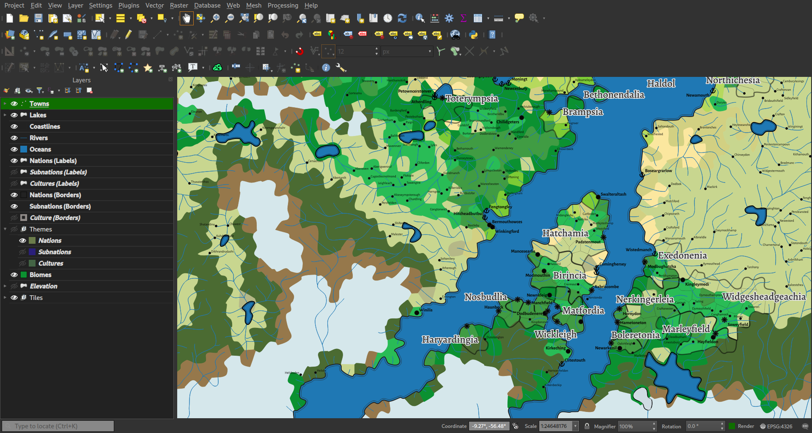
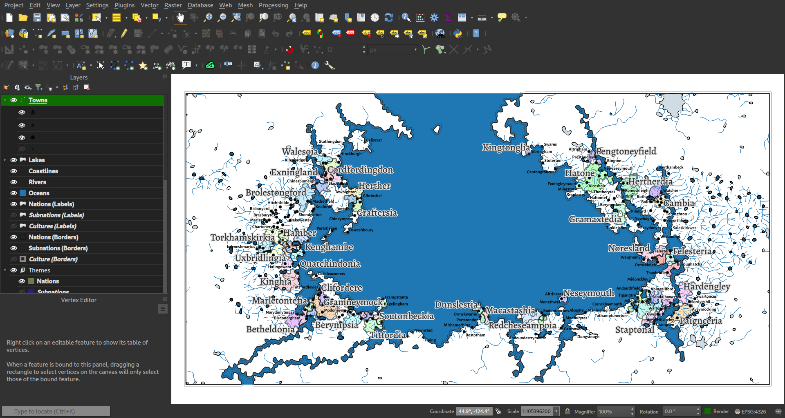
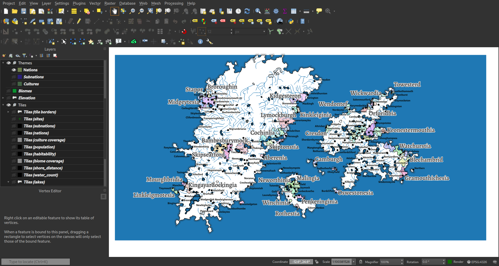
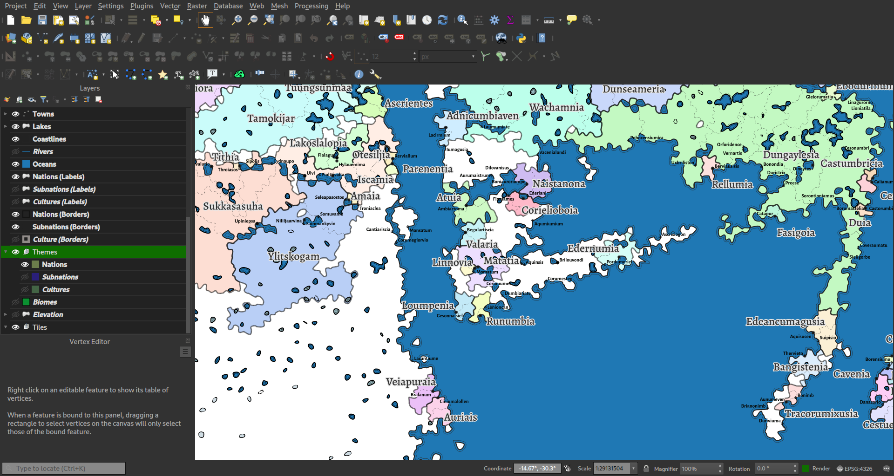

# Cosmopoeia

For years I've wanted a tool to generate fantasy maps for [GIS](https://en.wikipedia.org/wiki/Geographic_information_system). Now, I've built it, and I call it **Cosmopoeia**.

Cosmopoeia can generate a world, either from scratch or from an existing heightmap, complete with water features, biomes, towns, and nations. The result is a [geopackage](https://en.wikipedia.org/wiki/GeoPackage) file. This file can then be opened in [QGIS](https://en.wikipedia.org/wiki/QGIS) and similar software, to touch up and create nice maps of the world in whatever style you want.

# How It Works

Cosmopoeia was inspired by a number of tools which generate worlds for the internet. The biggest inspiration is a tool is [Fantasy Map Generator](https://azgaar.github.io/Fantasy-Map-Generator/) created by Azgaar ([Github site here](https://github.com/Azgaar/Fantasy-Map-Generator)). That itself was inspired by several other tools and experiments by [Martin O'Leary (link broken)](https://mewo2.com/notes/terrain) , [Amit Patel](http://www-cs-students.stanford.edu/~amitp/game-programming/polygon-map-generation), and [Scott Turner](https://heredragonsabound.blogspot.com/).

**Interface**. Cosmpoeia runs from the command line. Options and results are entered as arguments. The world can be generated all at once, or in steps, allowing for manipulation and adjustment of data in between. The output is a data file which can be edited using GIS software. This architecture allows cosmopoeia to focus on generating terrain, and not on user interface design. The graphical user interface is provided by the GIS software used for editing the maps after generation.

**Tiles**. Cosmopoeia, like all of those tools, bases it's generation on a world described by randomly-shaped tiles, called a [Voronoi diagram](https://en.wikipedia.org/wiki/Voronoi_diagram). The result is something vaguely like a hex-map, but with irregular polygons, allowing for a more chaotic look. Indeed, I believe the algorithms combined together are an example of [true chaos](https://en.wikipedia.org/wiki/Chaos_theory), in that only a small change at the beginning can create a very different result.

**Terrain**. After generating tiles, Cosmopoeia assigns elevations to the tiles. This is done either by generating terrain using recipes which describe how the terrain should be built up, or sampling data at the center of the tile from an existing [heightmap](https://en.wikipedia.org/wiki/Heightmap). Cosmopoeia also determines where oceans should be during this phase.

**Climate, Water and Biomes**. Cosmpoeia uses simple algorithms to estimate average annual temperatures, wind direction, and relative precipitation. It then calculates flow along the tiles in order to create rivers and lakes. From this, it can then generate a biome for each tile. None of the algorithms used are intended to simulate the real world, and are not based on real scientific models of these processes. The goal of cosmopoeia is verisimilitude, the appearance of reality, not simulation.

**People**. Once biomes and water features are available, it is possible to apply population to the tiles. From there, towns can be created, followed by nations and subnations (states, provinces, etc.). A simple random name generator using a [Markov process](https://en.wikipedia.org/wiki/Markov_chain) is used to apply names to these places.

**Regions**. Once each of the elements are created on the tiles, those tiles are united together into larger shapes based on features such as biomes and nations, and placed into their own layers. The boundaries of these regions are then adjusted to follow bezier curves, creating a more natural look.

# Screenshots

Here are a few worlds created using Cosmopoeia, as shown in QGIS.









# Getting Started

To get started using Cosmopoeia, you will need a few configuration files. To make things easier, some pre-built files are provided with the software. You will need to find the path where these are installed on your machine, or download them from the `share` directory in this repository. Once you have found this directory, you can run the following command, where `$share/` would be replaced with the path to that directory and `$target/` is the directory in which you want to create the world.

```sh
cosmopoeia big-bang $target/World.gpkg --overwrite-all --cultures $share/culture_sets/afmg_culture_antique.json --namers $share/namers/afmg_namers.json --default-namer English --seed 9543572450198918714 blank 180 360 -90 -180 recipe-set --source share/terrain_recipes/afmg_recipes.json --recipe continents
```

After running this you can open up `World.gpkg` directly in your GIS software and start your own project. However, cosmopoeia provides a nice looking starting project for QGIS which will also help you understand the resulting data. 

To open up your world in QGIS with this project, use the following:

```sh
cp $share/qgis/World.qgz $target/World.qgz
qgis $target/World.qgz
```

The QGIS project file needs to be placed in the same directory as your geopackage file, and looks for a geopackage file named `World.gpkg`. However, once you've created the world, and your done with cosmopoeia, you may change file names however you want.

## Using a Heightmap

If you have an existing heightmap you would want to make use of, you can use the following command in place of the first command above, where `$source` is the path to your heightmap file.

```sh
cosmopoeia big-bang $target/World.gpkg --overwrite-all --cultures $share/culture_sets/afmg_culture_antique.json --namers $share/namers/afmg_namers.json --default-namer English --seed 9543572450198918714 from-heightmap $source recipe --source $share/terrain_recipes/heightmap-recipe.json
```

# Configuration

Cosmopoeia has a lot of configuration possibilities, and unfortunately my documentation is not complete and concise yet. It also includes some pre-designed configuration files in the `share` folder of this repository, which should also be included in your installation package.

**Commands**. Cosmopoeia requires a command to specify what task it should accomplish. The `big-bang` command is intended to be an all in one world generator, and is great for first time use. There are a lot of configuration options available for that command. You can also run the generation step-by-step instead of all at once, this allows you to have more control over the creation of world. For example, you can edit the terrain before climate generation is done, or edit the resulted biomes before nations are placed. For more information on what's possible, Cosmopoeia has a `help` command, or you can peruse the auto-generated [Commands](generated/Commands.md) documentation.

**Geopackage Schema**. The output data file includes a number of layers/tables, which can be pulled up in QGIS to edit and customize your maps. If you explore the provided QGIS project file, you can get a good feel on what data is available. You can also get detailed information on the tables and fields by reviewing the auto-generated [World File Schema](generated/World%20File%20Schema.md) documentation.

**Terrain Recipes**. In order to generate terrain, Cosmopoeia must follow a list of tasks which provide parameters for random terrain and ocean generation. A few pre-curated terrain recipes are included in the `share/terrain_recipes` folder. The `afmg_recipes.json` is a recipe set (a collection of named recipes) based on terrain generation templates from Azgaar's Fantasy Map Generator. The `heighmapt-recipe.json` is a single recipe which I've used to touch up a heightmap I used to generate a particular world of my own. For more information on the JSON structure required by these recipe files, see the auto-generated [Recipe Set Schema](generated/Recipe%20Set%20Schema.md) documentation.

**Namers**. In order to generate names for your world's political features, Cosmopoeia uses sample data from real-world and fantasy languages to create "Namers". These namers either make use of a Markov process to generate random names, or more simply randomly pick from a list of pre-generated words. Some pre-curated namer configuration files are found in the `share/namers` folder. The `afmg_namers.json` file is based off of "name bases" from Azgaar's Fantasy Map Generator. For more information on the JSON structure required for these namers, see the auto-generated [Namers Schema](generated/Namers%20Schema.md) documentation.

**Culture Sets**. In order to generate cultures for your world, Cosmopoeia uses some pre-configured culture data. Some pre-curated culture sets, as well as examples on how to generate random cultures, are found in the `share/culture_sets` folder. The `afmg_*.json` files are based off of culture sets from Azgaar's Fantasy Map Generator. The `random_cultures.json` file shows how you can configure the generation of random cultures using name generators only. For more information on the JSON structure required by these culture set files, see the auto-generated [Culture Schema](generated/Cultures%20Schema.md) documentation.

# Development Status

Cosmopoeia is developed in Rust. The strict typing of the language, and it's variable ownership system, makes it possible to ensure a stable program with whole categories of failure impossible. Unfortunately, this guarantee is limited by it's usage of the GDAL library for manipulation of the data files, as that library is built in C++ which is subject to the kinds of errors that Rust avoids.

**Beta Stage**. Cosmopoeia is currently in beta stage of development, but that does not mean it is full of bugs. This only means the configuration and algorithms will change, sometimes drastically. The cosmopoeia you run this year will not likely be the same one you run next year. Who knows if the name will even remain the same. There will not be a guarantee that a user would be able to create the same world twice, except by using the same random seeds in the same version of the software on the same platform. 

It will remain in beta for a long time. There will always be ways to improve it, and many improvements will require changes to the configuration and interface. So backwards compatibility is a non-existent priority.

**Scope**. The scope of Cosmopoeia is a tool that generates random geography for use in designing worlds. The tool is designed to do the tedious work of fantasy world-building, and leave you the fun and imaginative parts. For any given project, Cosmopoeia is only intended to be run a few times at the beginning. The rest of the project should be done using GIS and graphical editing tools.

**Testing**. I have not been good about creating unit tests for this code, despite that being a standard of most rust programs. My testing is done by simply running commands and looking at the results. This is more than just laziness, there are three reasons why creating tests are difficult:

* *Subjective results*: Whether a generation algorithm used in Cosmopoeia creates "correct" results is subjective. The only thing I can do is look at the results, gauge their verisimilitude, and watch for error messages. The best I could do is develop tests to guarantee that the same output always emerges from the same output, but this is not proof that an algorithm is correct.

* *Nondeterministic results*: Most of cosmopoeia revolves around randomness, which means that slight changes to algorithms -- even switching the order of two lines of code -- can have drastic changes to final results. This means that even if I test for the same results from the same input, those tests are going to fail quickly and often to the point that they are useless.

* *External dependencies*: The software produces database files using an external library. It is not easy to mock this database access, and testing would require routines to compare database files against previous output. Combined with the reasons above, I don't feel like this is worth the work.

Many bugs have been discovered only when I changed some minor thing, and even then only because it happened to cause some radical appearance change. For example: after changing code which would lead to generating exactly one more random number in a task, a whole new world was created which had a nation that was not unioned into a single polygon, but remained a collection of original tiles. This led to a reformatting of the union algorithm to make sure that geometries were valid and taking action if they weren't. The fix ensured that it wouldn't happen again, but I would never have discovered this problem if I had been using a different random seed for my test world.

